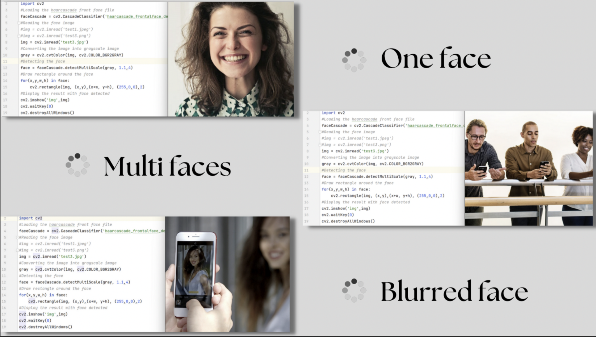
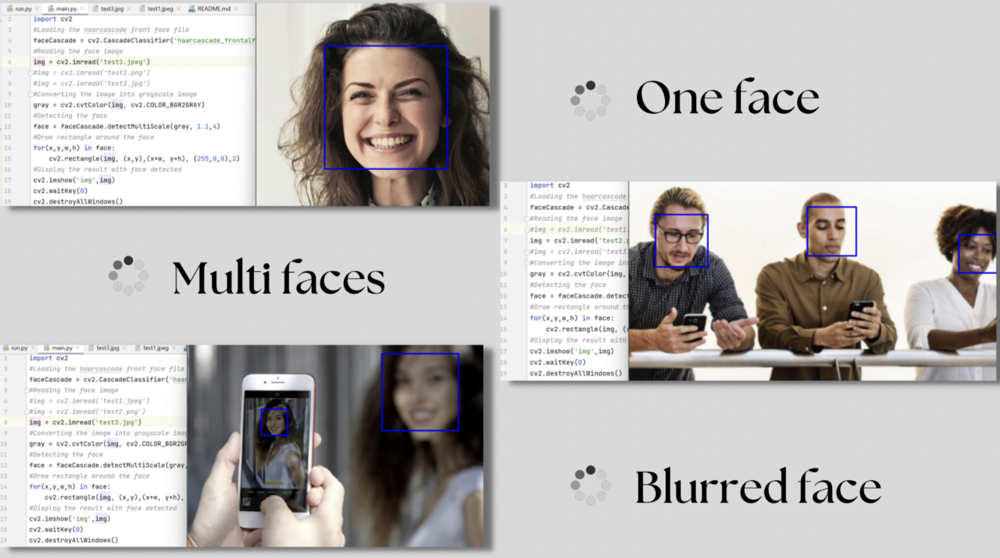

# Face Detection Technique

## Overview of The Proposed Methodology
In this project, we developed a **Face Detection System** using **Machine Learning (ML)** techniques that can accurately determine whether human faces appear in images. Our primary goal was to achieve high accuracy in face detection by utilizing pre-trained classifiers and machine learning software libraries.

## Why Machine Learning (ML)?
Machine learning is a branch of artificial intelligence that teaches computers to learn from data. It involves developing algorithms that detect patterns and make predictions. For face detection, we used **Haar Cascade** algorithm to analyze and separate faces from all other features present in an image.

### Motivation & Problem Statement
The main concern for sensitive systems requiring face detection is **accuracy**. High accuracy is essential for security and other critical applications. This project addresses the challenge of improving face detection accuracy, particularly in systems where detecting faces with high precision is crucial.

## Goals and Objectives
1. Display appropriate studies of face detection methods using **OpenCV** classifiers.
2. Develop a system that meets the project's accuracy requirements.
3. Detect faces in images using **OpenCV**.
4. Use pre-trained classifiers (Haar Cascade) for face and eye detection.

## Software Configuration
To run this system, you need the following software:
- **PC** with the following installed:
  - **PyCharm** (IDE for Python)
  - **Python** (Programming language)
  - Required Libraries:
    - **OpenCV (cv2)**
    - **Numpy**
    - **OS**

## Major Findings
We successfully achieved the project goals:
1. Reviewed appropriate face detection methods.
2. Found a suitable system for the project’s requirements.
3. Chose **OpenCV** as the main library for face detection.
4. Implemented face detection using the pre-trained **Haar Cascade** classifier.

## Face Detection Examples

### Face Detection - Before Detection
Here is an example of an image before face detection:

### Face Detection - After Detection
Here is an example of an image after face detection:

## Conclusion
The project successfully demonstrated the ability to detect faces with high accuracy using **Machine Learning (ML)** techniques. By utilizing **Haar Cascade Classifiers** and **OpenCV**, we were able to separate faces from other elements in images and apply the technique to various cases.

## Future Work
Future improvements could involve:
1. Testing the system with various types of images (e.g., different lighting, angles).
2. Improving the algorithm's performance to handle real-time face detection in video streams.
3. Exploring advanced face detection methods such as deep learning-based models (e.g., **YOLO** or **MTCNN**).

## Acknowledgements
We would like to thank the developers and contributors of **OpenCV** and **Haar Cascade** for providing powerful tools and libraries that made this project possible.
